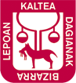

# decidim-getxo

Free Open-Source participatory democracy, citizen participation and open government for cities and organizations

This is the open-source repository for decidim-getxo, based on [Decidim](https://github.com/decidim/decidim).


## Credits

|   |   |
|---|---|
| Developed by | [](https://github.com/Platoniq) 
| Financed by | [](https://www.getxo.eus) |
| Powered by | [](https://github.com/decidim/decidim/) |
|   |   |


## Setting up the application

You will need to do some steps before having the app working properly once you've deployed it:

1. Open a Rails console in the server: `bundle exec rails console`
2. Create a System Admin user:

```ruby
user = Decidim::System::Admin.new(email: <email>, password: <password>, password_confirmation: <password>)
user.save!
```

3. Visit `<your app url>/system` and login with your system admin credentials
4. Create a new organization. Check the locales you want to use for that organization, and select a default locale.
5. Set the correct default host for the organization, otherwise the app will not work properly. Note that you need to include any subdomain you might be using.
6. Fill the rest of the form and submit it.

You're good to go!


## License

This engine is distributed under the [GNU AFFERO GENERAL PUBLIC LICENSE v3.0](LICENSE-AGPLv3.txt).
